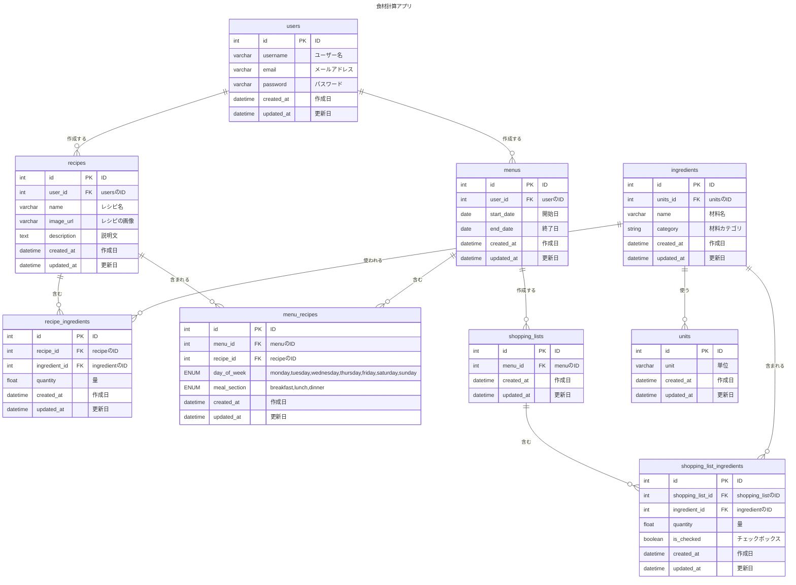

# Recipee

## 概要・背景

Recipee は、ユーザーが自分でレシピを登録し、レシピを選択することで必要な食材を買い物リストとして表示できるアプリです。

食材をまとめ買いをする際に、何を買うべきかを毎回考えたり、買い忘れを防ぐことができます。
レシピを登録すると買い物リストを表示するアプリは存在しますが、自分が作りたいレシピを 1 から作成できるものがなかったため、本アプリを開発しました。

## 対象ユーザー

- 料理が好きな人
- 食材の買い物を効率化したい人

## URL

URL: [https://recipe-shopper-app-3bth.vercel.app/](https://recipe-shopper-app-3bth.vercel.app/)

## 機能一覧

- ログイン（google 認証のみ対応）
- レシピを作成する機能
  - 材料は候補からのみ指定可能
- レシピを編集する機能
- レシピを削除する機能
- 登録したレシピから買い物リストを作成する機能

# ER 図

## 使用技術

- フロントエンド:
  - React
  - Next.js
  - Apollo Client
- バックエンド:
  - Apollo Server
- データベース:
  - PostgreSQL
  - prisma
- 認証:
  - Auth.js
- デプロイ:
  - FE:Vercel
  - BE:Render
  - DB:Render
